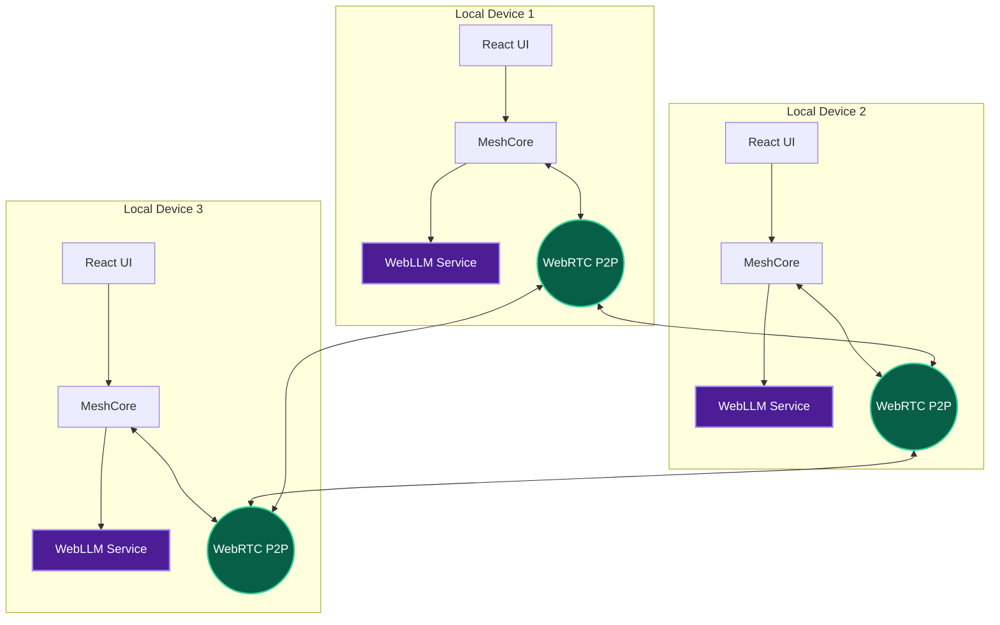

<div align="center">
  
# 🌐 Mesh·OS (sec-grid)
**Offline Emergency Network & Decentralized AI Triage**

[](https://reactjs.org/)
[](https://vitejs.dev/)
[](https://webrtc.org/)
[](https://webllm.mlc.ai/)
[](https://www.typescriptlang.org/)
[](https://sec-grid.vercel.app)

[Live Demo](https://sec-grid.vercel.app) • [Architecture](#architecture) • [Features](#features)

</div>

---

## 🌪️ The Problem
When disaster strikes, traditional centralized networks (cellular, ISP, DNS) are the first to fail. In life-threatening emergencies, coordinated triage and communication shouldn't rely on fragile infrastructure.

## 💡 The Solution: Mesh·OS
**Mesh·OS** is a zero-infrastructure, browser-based emergency mesh network. It leverages **WebRTC** for decentralized peer-to-peer communication and **WebLLM** for completely offline, on-device AI triage processing. Once loaded, the application can function entirely without the internet, healing its own network topology as nodes (devices) join and leave.

---

## ✨ Key Features

- **📡 True P2P Mesh Networking**: Self-healing WebRTC data channels combined with `BroadcastChannel` local fallback. No central server is required for transmission once peers are connected.
- **🧠 On-Device AI Triage (Phi-3.5)**: Powered by WebLLM, emergency SOS signals are analyzed, categorized, and prioritized by a local AI model running directly on your device's GPU (WebGPU) via WebAssembly. 100% private, 100% offline.
- **🛡️ Censorship & Proxy Resilience**: Built-in Vercel Edge proxies (`/hf-proxy-v2`) dynamically intercept and reroute model fetching, effectively bypassing restrictive ISPs and DNS filtering blocking HuggingFace CDNs.
- **⚡ Protocol Buffers (Protobuf)**: Extremely lightweight and compressed binary message serialization ensures fast transmission even on heavily degraded or congested networks.
- **📊 Real-Time Network Topology**: A beautiful, interactive visualization of the active mesh network using React Flow, mapping peer connections, signal strength, and simulated distances.
- **🔒 Cross-Origin Isolation**: Advanced security headers and `SharedArrayBuffer` support enables high-performance multi-threaded AI processing right in the browser.

---

## 🏗️ Architecture



### The Tech Stack
* **Frontend**: React 18, Vite, Tailwind CSS, Lucide Icons
* **Networking**: WebRTC API, BroadcastChannel, ProtobufJS
* **AI Engine**: `@mlc-ai/web-llm` running `Phi-3.5-mini-instruct-q4f16_1-MLC`
* **Graphing**: `@xyflow/react`
* **Hosting**: Vercel (with Edge proxy rewrites)

---

## 🚀 Getting Started

### Prerequisites
* Node.js v18+
* A modern browser with **WebGPU** support (Chrome 113+, Edge 113+).

### Installation

1. **Clone the repository**
   ```bash
   git clone https://github.com/PTP063/sec-grid.git
   cd sec-grid
   ```

2. **Install dependencies**
   ```bash
   npm install
   ```

3. **Run the development server**
   ```bash
   npm run dev
   ```

4. **Build for production**
   ```bash
   npm run build
   ```

---

## 🔧 Vercel Edge Proxy Configuration

Due to ISP restrictions in various regions, direct connections to HuggingFace infrastructure can be blocked. Mesh·OS implements a robust caching proxy bypass via `vercel.json` rewrites:

```json
{
  "rewrites": [
    {
      "source": "/hf-proxy-v2/(.*)",
      "destination": "https://huggingface.co/$1"
    },
    {
      "source": "/api/(.*)",
      "destination": "https://huggingface.co/api/$1"
    }
  ]
}
```
This forces the request to resolve securely through Vercel's edge network, entirely circumventing local DNS sinkholes.

---

## 🤝 Contributing

Contributions are heavily welcomed. In a crisis, the network is only as strong as its code. 

1. Fork the Project
2. Create your Feature Branch (`git checkout -b feature/AmazingFeature`)
3. Commit your Changes (`git commit -m 'Add some AmazingFeature'`)
4. Push to the Branch (`git push origin feature/AmazingFeature`)
5. Open a Pull Request

---

<div align="center">
  <p>Built with purpose. For the grid that never goes down.</p>
</div>
