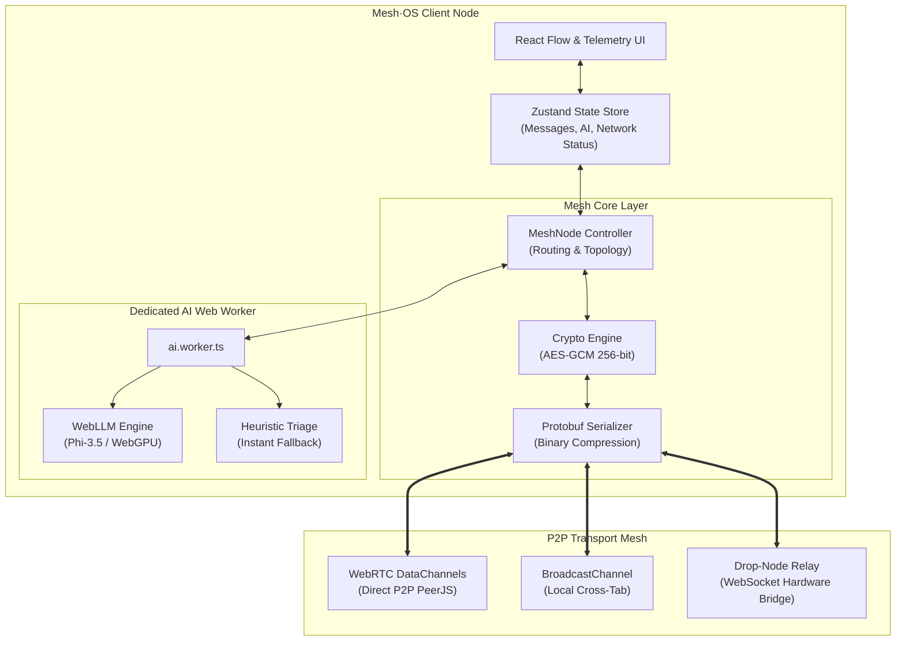

<div align="center">

# 🌐 Mesh·OS (sec-grid)
**Zero-Infrastructure Emergency Mesh Network with Decentralized AI Triage & End-to-End Encryption**

[](https://reactjs.org/)
[](https://vitejs.dev/)
[](https://www.typescriptlang.org/)
[](https://webrtc.org/)
[](https://webllm.mlc.ai/)
[](https://developer.mozilla.org/en-US/docs/Web/API/Web_Crypto_API)
[](https://web.dev/progressive-web-apps/)
[](https://sec-grid.vercel.app)

[**Live Demo**](https://sec-grid.vercel.app) • [**Architecture**](#-architecture) • [**Features**](#-key-features) • [**Quick Start**](#-getting-started) • [**Drop Node Relay**](#-hardware--drop-node-relay)

---

*"When the central grid fails, the mesh powers up."*

</div>

## 🌪️ The Problem
During catastrophic infrastructure failures—natural disasters, power grid collapses, conflict zones, or localized internet blackouts—traditional centralized telecommunications (cellular towers, ISPs, DNS) are vulnerable single points of failure. Critical emergency communication, resource coordination, and life-saving triage cannot wait for central servers to come back online.

## 💡 The Solution: Mesh·OS
**Mesh·OS** is a resilient, zero-infrastructure browser operating system designed for disconnected disaster scenarios. It forms dynamic peer-to-peer mesh networks across available client devices (phones, laptops, tablets, stationary relays) using **WebRTC DataChannels** and **BroadcastChannel**. 

Emergency SOS signals are prioritized via **on-device local AI models** running directly in the browser via WebAssembly & WebGPU. Messages are cryptographically sealed with **AES-GCM 256-bit encryption** and compressed using **Protocol Buffers**, enabling survivable communication across congested or intermittent channels.

---

## ✨ Key Features

- **📡 True P2P Multi-Hop Mesh Network**  
  Zero central coordination. Nodes connect directly via WebRTC DataChannels with automatic topology discovery, multi-hop routing, and fallback to `BroadcastChannel` for same-device cross-tab communication.

- **🔒 End-to-End Cryptography (Web Crypto API)**  
  Every transmission is secured with hardware-accelerated **AES-GCM 256-bit** encryption and SHA-256 integrity verification. Tamper-evident payloads protect sensitive civilian and rescue team transmissions.

- **🧠 Non-Blocking Distributed AI Triage**  
  Emergency signals are analyzed and prioritized (CRITICAL, HIGH, MEDIUM, LOW) by local LLMs (`Phi-3.5` / `Llama-3.2`) executing in a dedicated background **Web Worker**. Features automatic zero-lag heuristic fallback if WebGPU is unavailable on low-end hardware.

- **⚡ High-Compression Protocol Buffers (Protobuf)**  
  All packet schemas are compiled to binary protobuf payloads, reducing bandwidth usage by up to 90% compared to standard JSON over degraded links.

- **🛰️ Stationary Hardware Drop-Node Support**  
  Includes a standalone lightweight Node.js relay server ([`drop-node-server.js`](./drop-node-server.js)) that can run on Raspberry Pi, local field routers, or solar-powered emergency beacons to bridge fragmented mesh clusters.

- **📊 Live Interactive Topology & Telemetry**  
  Real-time visual node graph powered by **React Flow** with active link pulsation, battery level indicators, latency benchmarks, signal strength meters, and node role badges (Coordinator, Relay, Sensor, Edge).

- **📱 Offline-First Progressive Web App (PWA)**  
  Full service worker caching allows the application to launch and run indefinitely in airplane mode or disconnected environments after initial load.

- **🛡️ Censorship-Resistant Edge Proxies**  
  Vercel Edge middleware proxies dynamically route AI weight downloads and model metadata through edge endpoints (`/hf-proxy` & `/api`), bypassing regional ISP blocks on HuggingFace.

---

## 🏗️ Architecture



---

## 📁 Repository Structure

```text
├── drop-node-server.js          # Standalone WebSocket physical relay server
├── public/                      # Static assets & PWA manifest icons
├── src/
│   ├── ai/                      # On-device AI inference
│   │   ├── ai.worker.ts         # Dedicated Web Worker for non-blocking triage
│   │   └── WebLLMService.ts     # WebLLM wrapper & model weight manager
│   ├── components/              # UI & Visualization components
│   │   ├── network/             # React Flow mesh graph & custom nodes
│   │   └── ui/                  # Telemetry panel, controls, error alerts
│   ├── hooks/                   # Custom React hooks (useMeshVisualizer)
│   ├── network/                 # Core networking & transport
│   │   ├── Crypto.ts            # Web Crypto AES-GCM & SHA-256 utilities
│   │   ├── MeshNode.ts          # WebRTC P2P node engine & routing logic
│   │   └── serialization/       # Protocol Buffers schema & binary serializer
│   ├── store/                   # Zustand state stores (AI, messages, errors)
│   ├── App.tsx                  # Main application orchestrator
│   └── main.tsx                 # Entrypoint with PWA registration
├── vercel.json                  # Edge proxy rewrites & COOP/COEP headers
└── vite.config.ts               # Vite configuration & PWA worker settings
```

---

## 🚀 Getting Started

### Prerequisites
* **Node.js**: v18.0.0 or higher
* **npm**: v9.0.0 or higher
* Modern browser with WebRTC support (Chrome, Firefox, Safari, Edge). *WebGPU is recommended for hardware-accelerated local LLM inference.*

### Installation

1. **Clone the repository**:
   ```bash
   git clone https://github.com/PTP063/sec-grid.git
   cd sec-grid
   ```

2. **Install dependencies**:
   ```bash
   npm install
   ```

3. **Start the local development server**:
   ```bash
   npm run dev
   ```
   Open `http://localhost:5173` in your browser. Open multiple tabs or different devices on the same network to observe peer discovery in real time.

4. **Build for production**:
   ```bash
   npm run build
   ```

---

## 🛰️ Hardware & Drop-Node Relay

For disaster response teams deploying physical field relays (e.g. Raspberry Pi running on solar power or a vehicle-mounted hotspot):

```bash
# Run the standalone headless drop node server
node drop-node-server.js
```
The server will initialize a high-throughput WebSocket repeater on port `8080` (or specified `PORT`), acting as a permanent store-and-forward mesh bridge.

---

## 🔒 Security & Deployment Headers

Mesh·OS utilizes `SharedArrayBuffer` for multi-threaded WebAssembly performance. Production deployments must serve proper Cross-Origin Isolation headers:

```json
{
  "headers": [
    {
      "source": "/(.*)",
      "headers": [
        { "key": "Cross-Origin-Embedder-Policy", "value": "require-corp" },
        { "key": "Cross-Origin-Opener-Policy", "value": "same-origin" }
      ]
    }
  ]
}
```

---

## 🤝 Contributing

Contributions are welcome! Please feel free to submit issues and pull requests:

1. Fork the repository
2. Create your feature branch (`git checkout -b feature/AmazingFeature`)
3. Commit your changes (`git commit -m 'feat: Add AmazingFeature'`)
4. Push to the branch (`git push origin feature/AmazingFeature`)
5. Open a Pull Request

---

<div align="center">
  <sub>Built for resilience. Zero infrastructure, zero single points of failure.</sub>
</div>
