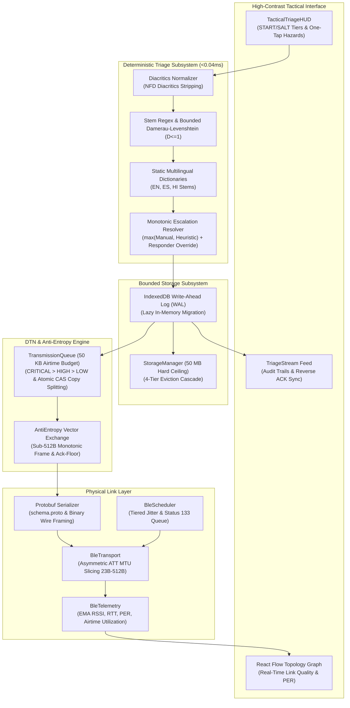

<div align="center">

# 🌐 Mesh·OS
**Zero-Infrastructure Emergency Delay-Tolerant Mesh Operating System with Deterministic START/SALT Triage & Hardware-Bounded Anti-Entropy Sync**

[](https://www.typescriptlang.org/)
[](https://vitejs.dev/)
[](https://capacitorjs.com/)
[](https://www.bluetooth.com/)
[](https://protobuf.dev/)
[](https://web.dev/progressive-web-apps/)
[](./LICENSE)

[**Live Repository**](https://github.com/PTP063/sec-grid) • [**Architecture**](#-system-architecture) • [**Triage Engine**](#-deterministic-startsalt-triage-engine) • [**DTN & Anti-Entropy**](#-delay-tolerant-networking--anti-entropy) • [**Field Verification**](#-hardware-verification--field-testing) • [**Quick Start**](#-getting-started)

---

*"When the central grid fails, the mesh powers up."*

</div>

---

## 🌪️ The Problem
During catastrophic infrastructure blackouts—earthquakes, hurricanes, grid collapses, or conflict zones—centralized telecommunications (cellular base stations, fiber backbones, ISPs, DNS) are vulnerable single points of failure. In true disaster environments:
1. **Zero Connectivity**: Mobile devices cannot reach external cloud servers or download heavy assets.
2. **Extreme Contact Windows**: Disconnected search-and-rescue clusters encounter each other only for brief **3- to 10-second windows** (responders walking past each other or passing vehicles).
3. **Severe Battery & Storage Limits**: Edge mobile phones cannot run battery-draining on-device LLMs (e.g. 2GB neural weights via WebGPU) or flood degraded BLE channels with unconstrained packet dumps.

---

## 💡 The Solution: Mesh·OS

**Mesh·OS** is a zero-infrastructure, offline-first emergency mesh operating system designed for edge mobile devices and field base stations. It operates seamlessly as a hardened Progressive Web App (PWA) and Capacitor native hybrid application utilizing autonomous Bluetooth Low Energy (BLE) peripheral/central roles.

### Core Architectural Pillars:
- **⚡ Sub-Millisecond Deterministic Triage**: Replaced heavy on-device neural runtimes with a zero-allocation, sub-millisecond (**<0.04 ms**) START/SALT mass-casualty triage engine with typo resilience and multilingual dictionaries (`EN`, `ES`, `HI`).
- **📦 711 KB Total Precache Footprint**: Reduced application payload by **89.4%** (from 6.7 MB down to 711 KB), ensuring instantaneous airplane-mode bootstrapping from flash storage.
- **🔄 Delay-Tolerant Network (DTN) Anti-Entropy Sync**: Opportunistic store-and-forward data muling with sub-512B binary Originator-Monotonic Sequence Vectors and Ack-Floors for zero-overhead delta negotiation ($A \setminus B$).
- **🛡️ Storage-Bounded Bounded WAL & Priority Queue**: Strict 50 MB hard storage ceiling with a 4-tier deterministic eviction cascade and immutable preservation of local `CRITICAL` triage records.
- **📡 Native BLE Collision-Avoidance Transport**: Jittered duty-cycle scheduler preventing Android Fluoride Status 133 connection exhaustion, paired with asymmetric ATT MTU chunk slicing and real-time link-layer RF telemetry.

---

## 🏗️ System Architecture



---

## 🩺 Deterministic START/SALT Triage Engine

In an off-grid mass-casualty disaster, non-deterministic neural networks that download gigabytes of weights are operational liabilities. Mesh·OS implements a **100% deterministic, zero-dependency, sub-millisecond triage engine** conforming to international **START** (Simple Triage and Rapid Treatment) and **SALT** protocols.

### 1. Classification & Vitals Ingestion
- **`CRITICAL` (Red / Immediate)**: Catastrophic trauma (arterial hemorrhage, apnea, pulseless shock, crush entrapment, severe burns, infant distress).
- **`HIGH` (Yellow / Delayed)**: Severe non-ambulatory injuries, compound fractures, smoke inhalation, deep lacerations.
- **`LOW` (Green / Minor)**: Ambulatory ("walking wounded"), minor abrasions, food/water/blanket requests.
- **Vitals Integration**: Accepts physiological inputs (respiration rate, radial pulse/perfusion, mental status commands).

### 2. Typo Resilience via Bounded Damerau-Levenshtein ($D \le 1$)
Panicked victims frequently submit degraded text. Unmatched tokens $\ge 5$ characters are checked against critical life-threat roots using an allocation-free Damerau-Levenshtein distance bounded strictly to $D \le 1$:
- `"hemarage"` $\to$ matches root `"hemorrhage"` $\to$ **CRITICAL**
- `"unconcious"` $\to$ matches root `"unconscious"` $\to$ **CRITICAL**
- `"cant breth"` $\to$ matches root `"breath"` $\to$ **CRITICAL**
- `"crushd"` $\to$ matches root `"crushed"` $\to$ **CRITICAL**

### 3. Decoupled Multilingual Lexicons
Emergency roots and situational hazard patterns are partitioned into static lookup tables:
- [`src/triage/lexicons/en.ts`](./src/triage/lexicons/en.ts): English trauma stems.
- [`src/triage/lexicons/es.ts`](./src/triage/lexicons/es.ts): Spanish disaster vocabulary (`sangrado`, `inconsciente`, `no respira`, `atrapado`, `fuego`).
- [`src/triage/lexicons/hi.ts`](./src/triage/lexicons/hi.ts): Hindi / Hinglish disaster vocabulary (`khoon`, `saans`, `behosh`, `daba hua`, `aag`, `bijli ka taar`).

### 4. Monotonic Escalation & Responder Override Invariant
- **Civilian Input**: Enforces a strictly upward monotonic rule:
  $$\text{FinalPriority} = \max(\text{ManualPriority}, \text{HeuristicPriority})$$
  A civilian tapping `🟢 STABLE` while entering `"spurting blood under rubble"` is automatically escalated to `🔴 CRITICAL` with a HUD alert chip.
- **Certified Responder Override**: Downgrading below heuristic severity is permitted exclusively when `isResponder: true` with a verified responder node key. The packet is stamped with `triageMethod: MANUAL_OVERRIDE` and tagged with `[RESPONDER_OVERRIDE:<id>]`.

---

## 📬 Delay-Tolerant Networking & Anti-Entropy

Mesh clusters frequently split and reconnect across physical dead zones. Instead of blind channel flooding, nodes exchange mathematical delta summaries.

### 1. Originator-Monotonic Sequence Vectors with Ack-Floors
Probabilistic Bloom filters suffer from false-positive packet suppression (dropping life-critical SOS records) and cannot delete items without "zombie" re-propagation. Mesh·OS implements deterministic originator vectors:
- **Vector Layout**: Each entry packs `originatorId` (16-byte UUID), `ackFloor` (uint64), and `activeBitmask` (uint64).
- **Sub-512B Frame**: A 10-node cluster summary packs into **326 bytes**, fitting entirely within the first negotiated BLE ATT MTU window without GATT fragmentation.
- **Ack-Floor Invariant**: Any packet sequence $\le \text{ackFloor}$ is recognized across all network nodes as permanently delivered and purged.

### 2. Priority-Ordered Queue & 50 KB Airtime Budget
- Over BLE 1M PHY at -80 dBm, connection parameters yield an effective GATT throughput of ~12 KB/s. In a 5-second physical contact window, usable airtime is ~4.2 seconds.
- `TransmissionQueue.ts` caps batches to **$\le 50$ KB or 60 records max**, strictly prioritizing:
  1. Priority tier (`CRITICAL` > `HIGH` > `LOW`).
  2. Staleness / Generation timestamp (newest emergency telemetry first).
  3. Spray-and-Wait allowance (`copiesLeft`).

### 3. Dual-Role Bridge Invariant & Atomic Copy Halving
When a mobile node bridges two peers simultaneously (Central to Node A and Peripheral to Node B), queue access is guarded by an `AsyncMutex`. Spray-and-Wait copies are split using atomic Compare-And-Swap (CAS) halving:
$$\text{copiesToSend} = \lfloor \text{copiesLeft} / 2 \rfloor, \quad \text{copiesRemaining} = \text{copiesLeft} - \text{copiesToSend}$$
Guarantees that total network copies are conserved and never duplicated out of thin air.

### 4. Bounded Storage Manager & Eviction Cascade
Guarantees Mesh·OS never exceeds an operator-defined hard ceiling (**50 MB**):
- **Tier 1 Eviction**: Drop `RESOLVED` incidents older than 6 hours.
- **Tier 2 Eviction**: Drop expired `LOW` priority payloads whose TTL $\le 1$.
- **Tier 3 Eviction**: Halve or drop replicated `HIGH` priority payloads with `copiesLeft > 1`.
- **Tier 4 (Strict Non-Eviction Invariant)**: **Un-replicated `CRITICAL` triage records originating from the local device are mathematically immune to eviction.**

---

## 🔬 Hardware Verification & Field-Testing

### Link-Layer RF & Power Telemetry ([`BleTelemetry.ts`](./src/diagnostics/BleTelemetry.ts))
- **Exponential Moving Average (EMA) RSSI**: $\overline{\text{RSSI}}_t = 0.2 \cdot \text{RSSI}_t + 0.8 \cdot \overline{\text{RSSI}}_{t-1}$ to filter multipath fading.
- **GATT RTT & PER Tracking**: Continuously monitors Packet Error Rate and estimated airtime utilization.
- **24-Hour Blackout Survival Projection**: Calculates real-time scan/connection duty cycles and warns when battery discharge velocity threatens survival.

### Anti-Collision Scheduler ([`BleScheduler.ts`](./src/diagnostics/BleScheduler.ts))
- Prevents Android Bluetooth Stack Status 133 exhaustion via a single-flight serialized connection queue.
- Tiered scan duty cycles:
  - *Normal*: 1.5s scan every 10s with $\pm 20\%$ randomized jitter (~15% duty cycle).
  - *Idle*: 1.5s scan every 30s with $\pm 20\%$ jitter (~5% duty cycle) after 5 minutes quiet.
  - *Surge*: 2.0s scan every 5s with $\pm 15\%$ jitter (~40% duty cycle) when un-replicated `CRITICAL` packets are queued.

---

## 📁 Repository Structure

```text
├── docs/
│   └── FIELD_TESTING_RUNBOOK.md    # Multi-device physical field verification protocol
├── scripts/
│   ├── run-triage-tests.mjs         # Deterministic START/SALT test runner
│   ├── run-dtn-simulation.mjs       # DTN store-and-forward muling simulation
│   ├── run-ble-stress-tests.mjs     # 32-permutation asymmetric MTU stress harness
│   └── test-ble-fragmentation.mjs   # BLE ATT MTU slicing & chunk reassembly test
├── src/
│   ├── components/
│   │   ├── network/MeshGraph.tsx    # Interactive React Flow mesh topology canvas
│   │   └── ui/
│   │       ├── TacticalTriageHUD.tsx # High-contrast structured input HUD
│   │       ├── TelemetryPanel.tsx   # Link metrics, audit trails, and role controls
│   │       ├── AlertBanner.tsx      # High-priority tactical alert banner
│   │       └── QuickMacros.tsx      # Instant emergency macro chips
│   ├── diagnostics/
│   │   ├── BleScheduler.ts          # Collision avoidance, jitter & status 133 queue
│   │   └── BleTelemetry.ts          # Link-layer RF metrics, PER & power telemetry
│   ├── dtn/
│   │   ├── AntiEntropy.ts           # State vectors, ack-floors & sub-512B frame sync
│   │   └── TransmissionQueue.ts     # Priority queue, 50KB airtime limiter & copy halving
│   ├── network/
│   │   ├── BleTransport.ts          # Native BLE transport & ATT MTU chunk slicing
│   │   ├── Serializer.ts            # Protobuf encoders/decoders & UUID compacting
│   │   └── types.ts                 # Network interfaces & packet definitions
│   ├── proto/
│   │   ├── schema.proto             # Canonical Protobuf schema specification
│   │   └── schema.ts                # Isomorphic schema export for Node/Vite runtimes
│   ├── storage/
│   │   ├── StorageManager.ts        # 50 MB hard quota & 4-tier eviction cascade
│   │   └── WAL.ts                   # IndexedDB Write-Ahead Log & lazy migration
│   ├── store/
│   │   ├── useTriageStore.ts        # Synchronous triage state store
│   │   ├── useMessageStore.ts       # Message feed & incident filter store
│   │   └── useMeshStore.ts          # Mesh topology, keys, and role store
│   ├── test/
│   │   ├── DeterministicTriage.spec.ts # START/SALT, typo & multilingual tests
│   │   ├── DtnSimulation.spec.ts    # End-to-end data mule simulation test
│   │   └── BleStressHarness.ts      # Chaos injection & dropped fragment test
│   ├── triage/
│   │   ├── DeterministicTriage.ts   # Core zero-allocation triage engine
│   │   └── lexicons/                # Static emergency dictionaries (EN, ES, HI)
│   ├── App.tsx                      # Dashboard layout & event orchestrator
│   ├── main.tsx                     # React root & lifecycle registration
│   └── sw.ts                        # Zero-network PWA Service Worker (711 KB precache)
├── capacitor.config.ts              # Capacitor native bridge configuration
├── package.json                     # Cleaned dependencies (zero neural weights)
└── vite.config.ts                   # Vite PWA & Rollup bundle configuration
```

---

## 🚀 Getting Started

### Prerequisites
* **Node.js**: `v20.0.0` or higher
* **npm**: `v9.0.0` or higher
* Modern browser with Bluetooth Web API or Capacitor native runtime on Android/iOS.

### Local Development Setup

1. **Clone the repository**:
   ```bash
   git clone https://github.com/PTP063/sec-grid.git
   cd sec-grid
   ```

2. **Install dependencies**:
   ```bash
   npm install
   ```

3. **Start the local development server**:
   ```bash
   npm run dev
   ```
   Open **[https://localhost:5173/](https://localhost:5173/)** in your browser. (Accept the local development self-signed SSL certificate to allow Web Crypto and Wake Lock APIs).

---

## 🧪 Verification & Test Commands

Mesh·OS includes an automated suite of deterministic test harnesses:

```bash
# 1. Run START/SALT Deterministic Triage Protocol Suite (Speed, Typos, Multilingual, Escalation)
npx tsx scripts/run-triage-tests.mjs

# 2. Run Multi-Hop DTN Store-and-Forward Muling & Anti-Entropy Simulation
npx tsx scripts/run-dtn-simulation.mjs

# 3. Run Asymmetric BLE MTU & Chaos Injection Stress Harness (32 Permutations)
npx tsx scripts/run-ble-stress-tests.mjs

# 4. Run ATT MTU Slicing & Reassembly Fragmentation Verification
npx tsx scripts/test-ble-fragmentation.mjs

# 5. Run Static Analysis & Linter
npm run lint

# 6. Run Production Build (TypeScript Typecheck & Vite PWA Bundle)
npm run build
```

---

## 📄 License

Distributed under the **MIT License**. See [`LICENSE`](./LICENSE) for more information.

<div align="center">
  <sub>Built for human resilience. Zero infrastructure, zero single points of failure.</sub>
</div>
