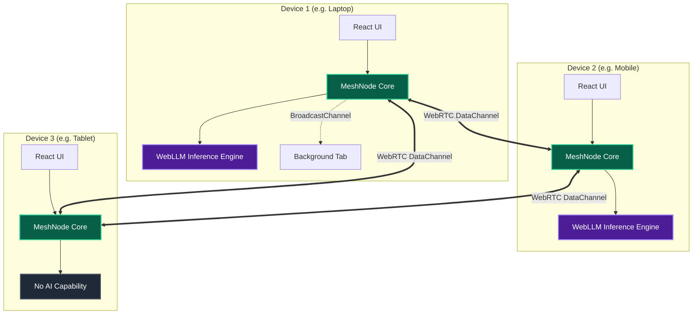

<div align="center">

# 🌐 Mesh·OS (sec-grid)
**Zero-Infrastructure Emergency Mesh Network with Decentralized AI Triage**

[](https://reactjs.org/)
[](https://vitejs.dev/)
[](https://webrtc.org/)
[](https://webllm.mlc.ai/)
[](https://www.typescriptlang.org/)
[](https://sec-grid.vercel.app)

[**Launch Application**](https://sec-grid.vercel.app) • [**Architecture**](#-architecture) • [**Features**](#-features) • [**Deployment**](#-deployment)

---

*"When the grid goes down, the mesh powers up."*

</div>

## 🌪️ The Problem
In catastrophic emergencies—hurricanes, earthquakes, conflict zones, or authoritarian internet blackouts—traditional centralized networks (cellular, ISP, DNS) are the first systems to fail. When life-threatening situations arise, coordinated triage and critical communication shouldn't rely on fragile, centralized infrastructure.

## 💡 The Solution: Mesh·OS
**Mesh·OS** is a zero-infrastructure, browser-based emergency mesh network. It leverages **WebRTC** for decentralized peer-to-peer communication and **WebLLM** for completely offline, on-device AI triage processing. Once loaded into the browser cache, the application functions entirely without the internet, healing its own network topology as nodes (devices) join and leave.

---

## ✨ Key Features

- **📡 True P2P Mesh Networking**  
  Self-healing **WebRTC DataChannels** power cross-device communication, seamlessly falling back to `BroadcastChannel` for local tabs. There are no central servers for messaging—once connected, the mesh operates entirely peer-to-peer.
  
- **🧠 Distributed On-Device AI Triage (Phi-3.5)**  
  Emergency SOS signals are analyzed, categorized, and prioritized by a local AI model (`Phi-3.5-mini-instruct-q4f16_1-MLC`) running directly on your device's GPU via WebAssembly. Devices capable of AI processing automatically triage raw messages and broadcast the prioritized results back to the entire mesh. **100% private, 100% offline.**

- **🛡️ Censorship & Proxy Resilience**  
  Built-in Vercel Edge proxies (`/hf-proxy` & `/api`) dynamically intercept and reroute AI model fetching, completely bypassing restrictive ISPs and DNS filtering that block HuggingFace infrastructure.

- **⚡ High-Compression Protocol Buffers (Protobuf)**  
  To survive degraded, congested, or low-bandwidth environments, all mesh communications are serialized into lightweight binary payloads using Protocol Buffers, cutting overhead by up to 90%.

- **📊 Real-Time Network Topology**  
  An interactive, glassmorphic visualization of the active mesh network built with **React Flow**. It dynamically maps peer connections, node lifecycles, and visually pulses when data traverses the mesh.

- **🔒 Cross-Origin Isolation**  
  Advanced security headers (`Cross-Origin-Embedder-Policy` and `Cross-Origin-Opener-Policy`) enable `SharedArrayBuffer` support, unlocking extreme multi-threaded AI performance directly inside the browser.

---

## 🏗️ Architecture



### The Tech Stack
* **Frontend**: React 18, Vite, Tailwind CSS (v4), Lucide Icons
* **Networking**: WebRTC API (PeerJS), BroadcastChannel, ProtobufJS
* **AI Engine**: `@mlc-ai/web-llm` running **Phi-3.5-mini-instruct** (Q4 Quantization)
* **Visualizer**: `@xyflow/react`
* **Hosting**: Vercel (Edge Proxy Rewrites + Cross-Origin Headers)

---

## 🚀 Getting Started

### Prerequisites
* **Node.js v18+**
* A modern browser with **WebGPU** support (Chrome 113+, Edge 113+).

### Installation & Development

1. **Clone the repository**
   ```bash
   git clone https://github.com/PTP063/sec-grid.git
   cd sec-grid
   ```

2. **Install dependencies**
   ```bash
   npm install
   ```

3. **Run the development server**
   ```bash
   npm run dev
   ```

4. **Build for production**
   ```bash
   npm run build
   ```

---

## 🔧 Deployment & Infrastructure

### Vercel Edge Proxy Configuration
In restrictive environments, direct connections to HuggingFace are often blocked. Mesh·OS circumvents this using a `vercel.json` edge rewrite. It also enforces `SharedArrayBuffer` support via strict Cross-Origin headers.

```json
{
  "headers": [
    {
      "source": "/(.*)",
      "headers": [
        { "key": "Cross-Origin-Embedder-Policy", "value": "require-corp" },
        { "key": "Cross-Origin-Opener-Policy", "value": "same-origin" }
      ]
    }
  ],
  "rewrites": [
    {
      "source": "/hf-proxy/(.*)",
      "destination": "https://huggingface.co/$1"
    },
    {
      "source": "/api/(.*)",
      "destination": "https://huggingface.co/api/$1"
    }
  ]
}
```

---

## 🤝 Contributing

In a crisis, the network is only as strong as its code. Contributions are heavily welcomed.

1. Fork the Project
2. Create your Feature Branch (`git checkout -b feature/AmazingFeature`)
3. Commit your Changes (`git commit -m 'Add some AmazingFeature'`)
4. Push to the Branch (`git push origin feature/AmazingFeature`)
5. Open a Pull Request

---

<div align="center">
  <p><b>Built with purpose. For the grid that never goes down.</b></p>
</div>
