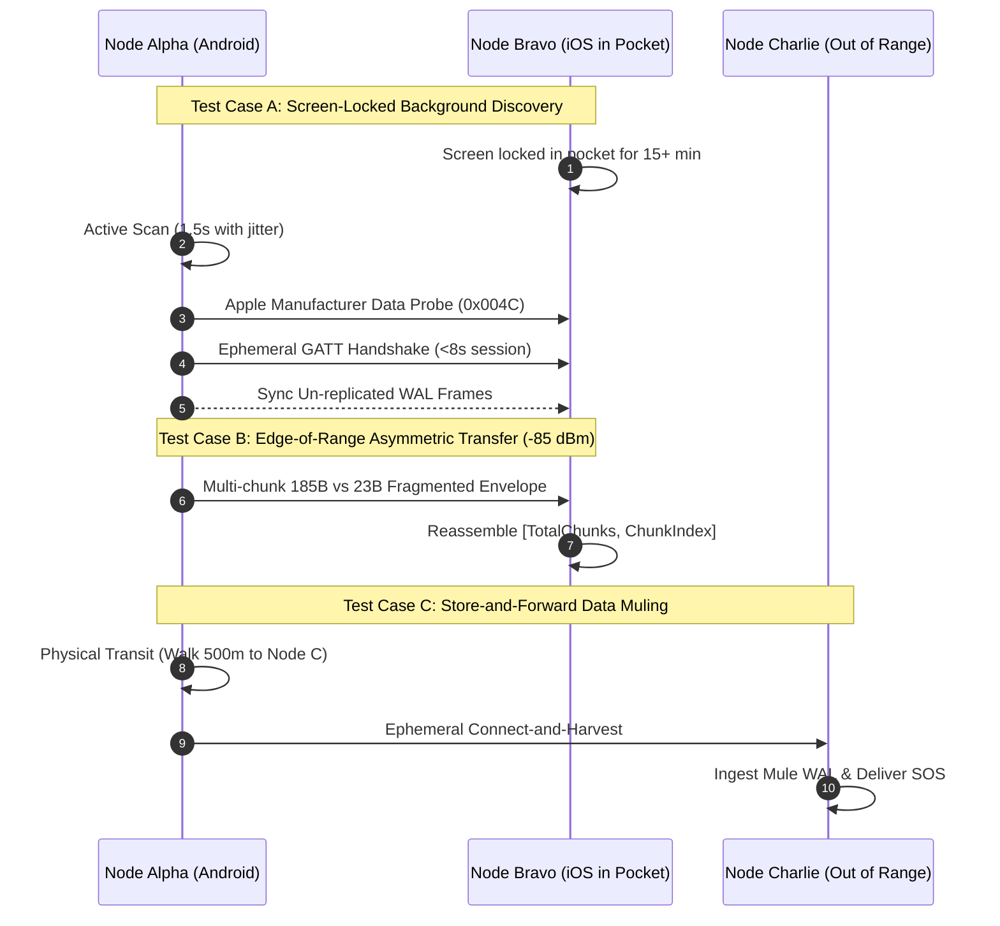

# Mesh·OS Native BLE Field-Testing Runbook (Phase 3)

## 1. Operational Overview

This runbook defines the physical radio verification and field-qualification protocol for **Mesh·OS** deployed on physical mobile hardware (iOS and Android). 

### Environmental Constraints
- **RF Spectrum:** 2.4 GHz ISM band.
- **Physical Environment:** Obstacle-dense emergency field conditions (concrete, masonry rubble, human body attenuation).
- **Network Isolation:** 100% Air-Gapped. Devices MUST operate in **Airplane Mode with Bluetooth ON**. No Wi-Fi, no cellular data, no internet access.

---

## 2. Hardware Test Rig Requirements

| Role | Minimum Spec | OS Baseline | Radio Hardware |
| :--- | :--- | :--- | :--- |
| **Node Alpha** | Primary Field Beacon | Android 12+ (API 31+) | BLE 5.0 (Broadcom / Qualcomm) |
| **Node Bravo** | iOS Mobile Station | iOS 16.0+ | Apple CoreBluetooth (185B MTU) |
| **Node Charlie** | Legacy Mobile Node | Android 9.0–11.0 (Budget/OEM) | BLE 4.2 (23-byte default ATT MTU) |
| **Node Delta** | Data Mule | Android or iOS | Portable, battery-powered |

---

## 3. Pre-Flight Verification Checklist

Before commencing field tests, verify the following on every participating handset:
1. [ ] **Airplane Mode Activated:** Cellular radio disabled, Wi-Fi toggled OFF.
2. [ ] **Bluetooth Active:** Bluetooth toggle ON in OS settings.
3. [ ] **Battery Verification:** Device charged to at least 70%.
4. [ ] **Battery Optimization Exemption:**
   - *Android:* Set App Battery Usage to **"Unrestricted"** (prevents Doze mode process termination).
   - *Android:* Verify Foreground Service notification (`Mesh·OS Emergency Relay`) appears in the persistent notification tray.
   - *iOS:* Verify `Background App Refresh` is toggled ON.
5. [ ] **Display Sleep Timeout:** Keep system default (30s or 1 min). Do NOT disable screen timeout; tests specifically validate screen-locked execution.

---

## 4. Physical Test Cases

---

### Test Case A: Screen-Locked Background Discovery

**Objective:** Verify that an iOS device running Mesh·OS with its screen locked in a pocket can be discovered and exchange triage frames with an Android node.

#### Procedure:
1. Launch Mesh·OS on **Node Bravo (iOS)**. Send a test triage SOS ("Pebble collapse, trapped citizen, low priority").
2. Lock Node Bravo's screen and place it into an operator's pocket or backpack.
3. Leave Node Bravo stationary and untouched for **15 minutes** (allowing iOS to transition into strict CoreBluetooth overflow advertising and deep background throttling).
4. Approach Node Bravo with **Node Alpha (Android)** from 20 meters away.
5. Observe Node Alpha's React Flow HUD and link-layer telemetry monitor.

#### Acceptance Criteria:
- [ ] Node Alpha discovers Node Bravo within **30 seconds** of entering radio range.
- [ ] Node Alpha's `BleScheduler` enqueues Node Bravo and initiates a single-flight ephemeral session.
- [ ] Node Bravo's queued triage SOS packet is transferred, unsealed via AES-GCM, and visualized on Node Alpha's incident queue.
- [ ] GATT session terminates cleanly within **8 seconds**, releasing native Fluoride/CoreBluetooth connection handles.

---

### Test Case B: Asymmetric Handshake & Fragmentation Under -85 dBm Weak RSSI

**Objective:** Verify that packets exceeding 500 bytes (e.g., compressed Protobuf emergency manifests with medical notes and GPS coordinates) fragment and reassemble flawlessly over lossy, edge-of-range RF links between devices with mismatched MTUs (Node Bravo 185B MTU vs. Node Charlie 23B MTU).

#### Procedure:
1. Position **Node Bravo (iOS - 185B MTU)** and **Node Charlie (Android - 23B MTU)** at opposite ends of a long hallway or behind a reinforced concrete wall.
2. Monitor Node Charlie's live telemetry until **EMA RSSI reads between -82 dBm and -88 dBm** (approaching the RF physical sensitivity threshold of -90 dBm).
3. From Node Charlie, dispatch a large 1,200-byte encrypted emergency situation report with multiple triage records.
4. With 23-byte MTU, this generates **~67 fragments** across the BLE link.
5. Repeat transmission in reverse: dispatch an 800-byte payload from Node Bravo (slicing into ~5 fragments under 185B MTU).

#### Acceptance Criteria:
- [ ] Both nodes successfully reassemble the complete Protobuf envelope.
- [ ] Packet Error Rate (PER) is tracked accurately in `BleTelemetry` without crashing or freezing the UI.
- [ ] No partial or malformed byte sequences are committed to IndexedDB WAL.
- [ ] In the event of dropped fragments due to RF fading, `FragmentationManager` discards the orphan buffer after 3 seconds and clears memory.

---

### Test Case C: Store-and-Forward Data Muling

**Objective:** Validate Epidemic / Spray-and-Wait Delay-Tolerant Networking (DTN) across disjoint partitions where direct radio propagation is impossible.

#### Procedure:
1. **Partition Setup:** Place **Node Alpha (Base Station)** and **Node Charlie (Field Camp)** 500 meters apart—completely out of radio reach.
2. Node Charlie initiates a `CRITICAL` triage alert: *"Traumatic arterial bleeding, structural collapse, immediate evacuation required"*.
3. Node Charlie's WAL commits the envelope with `copiesLeft: 6`, `ttl: 5`.
4. **Data Mule Dispatch:** Operator carrying **Node Delta (Data Mule)** enters Node Charlie's radio bubble.
5. Observe ephemeral handshake: Node Delta ingests the un-replicated envelope via BLE notification. Node Charlie splits copies (`copiesLeft: 3` retained, `copiesLeft: 3` transferred to Node Delta).
6. Operator carries Node Delta across the 500m blackout dead zone to Node Alpha (travel time: 10 minutes).
7. Node Delta arrives within 15 meters of Node Alpha.

#### Acceptance Criteria:
- [ ] Node Delta and Node Alpha auto-negotiate an ephemeral connection without user intervention.
- [ ] Node Delta forwards the zero-knowledge encrypted frame to Node Alpha.
- [ ] Node Alpha's incident log displays the `CRITICAL` distress record with intact cryptographic authentication tags.
- [ ] RFC 4303 64-bit sliding window filter verifies sequence freshness and prevents replay loops.

---

## 5. Diagnostic & Pass/Fail Matrix

| Symptom / Metric | Target Threshold | Root Cause / Corrective Action |
| :--- | :--- | :--- |
| **Android Status 133** | 0 occurrences | Verify 400ms inter-session cooldown in `BleScheduler.ts` and ensure `BleClient.disconnect()` is invoked before next `connect()`. |
| **Average GATT RTT** | < 120 ms | High latency indicates 2.4 GHz co-channel interference. Step 2 meters away from micro-wave or unshielded cables. |
| **Packet Error Rate (PER)** | < 15% (Nominal) | If PER > 40%, devices are exceeding maximum physical RF range (-88 dBm). Move nodes closer. |
| **Scan Duty Cycle Ratio** | < 20% (Normal) | If duty cycle exceeds 25% for >1 hour, verify `BleScheduler` is transitioning from SURGE back to NORMAL mode. |
| **Battery Discharge Velocity** | < 3.5% / hour | Ensures > 24 hours of continuous operation on a standard 3,500 mAh battery cell. |

---

## 6. Field Sign-Off Protocol

Upon successful completion of Test Cases A, B, and C with zero status 133 crashes and verified 24-hour battery preservation metrics:
1. Export the diagnostic telemetry log via the Mesh·OS HUD.
2. Verify all WAL checkpoints in IndexedDB report 0 corrupted transactions.
3. Certify hardware compatibility for field emergency responders.
